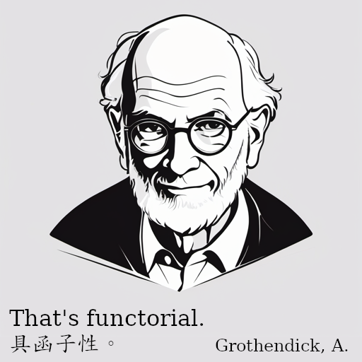
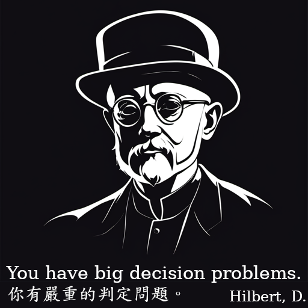
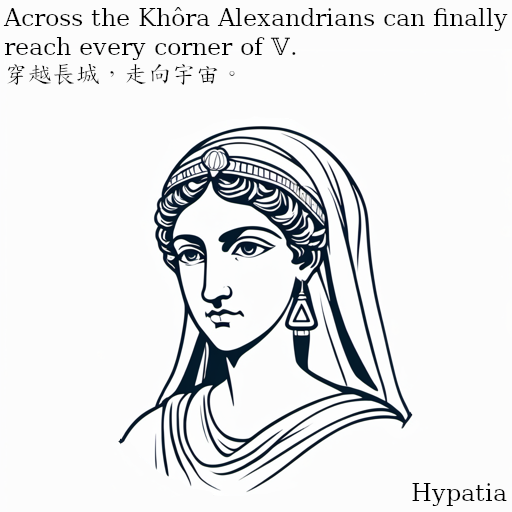
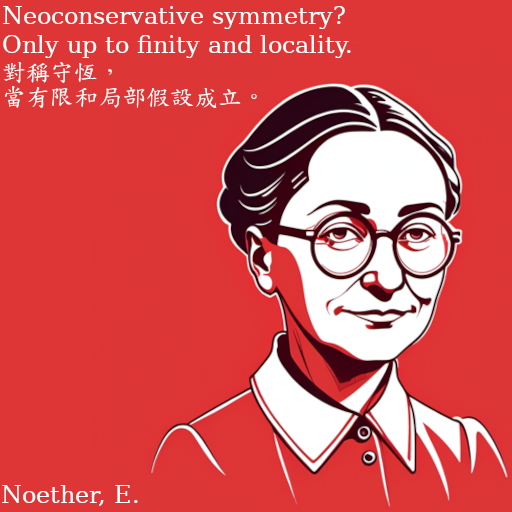
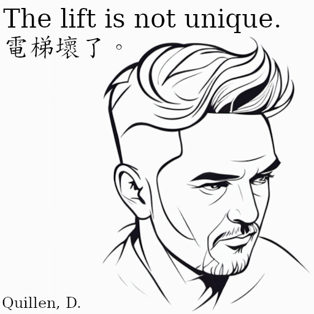
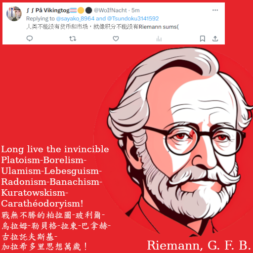
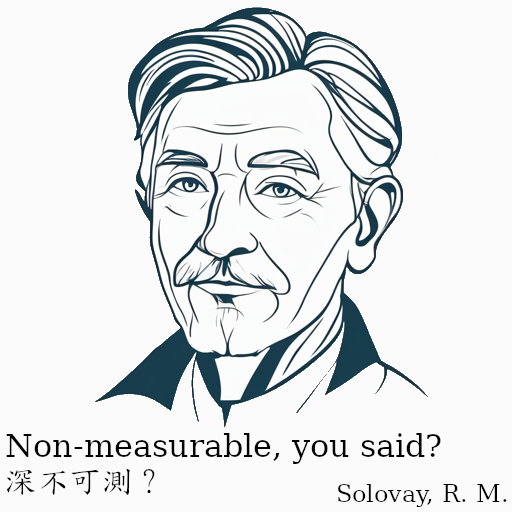

---
title: 'Idols of the Analytic Traditions'
author:
- Hypatia du Bois-Marie
keywords: [joke, meme, humor, mathematics, logic, formal methods, philosophy, linguistics]
abstract: |
...

<!-- pandoc index.md -s --mathjax --highlight-style pygments --bibliography /home/hypatia/Workspace/Library/zotero.bib --citeproc -c index.css -o index.html -->

[README](./README.html)

